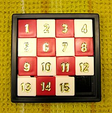

Eyou dan Ilov adalah sepasang sahabat yang sangat senang menghabiskan waktu mereka untuk bermain permainan yang mengasah otak.

Kali ini,mereka memainkan sebuah permainan yang sangat populer,yang bernama &ldquo;N Puzzle&rdquo;. Pada permainan ini,seorang pemain akan diberikan sebuah grid 2 dimensi yang terdiri dari N baris dan N kolom. Untuk memudahkan,kotak yang berada pada baris ke-i dan kolom ke-j akan dilambangkan dengan (i,j).

Akan terdapat tepat 1 kotak kosong dan sisanya akan diisi oleh bilangan-bilangan dari 1 sampai (N*N) &ndash; 1. Dijamin bahwa setiap bilangan hanya akan muncul tepat satu kali. Hanya ada satu jenis gerakan yang dapat dilakukan pemain dalam permainan ini yakni menukar posisi kotak yang kosong dengan kotak yang bersebelahan dengannya. Dua kotak dikatakan bersebelahan jika mereka memiliki satu sisi yang sama.

Di awal permainan,pemain akan diberikan grid dalam bentuk acak. Untuk memenangkan permainan,seorang pemain harus dapat membuat agar angka-angka pada grid tersusun menaik dari kotak (1,1) sampai (N,N &ndash; 1) dan kotak (N,N) berisi kotak kosong menggunakan gerakan yang telah dijelaskan.

Susunan akhir untuk N = 4

Setelah bermain seharian,Eyou dan Ilov terkadang dibuat kesal apabila ternyata untuk sebuah susunan grid,tidak ada cara yang memungkinkan untuk memenangkan permainan ini. Oleh karena itu,ia meminta bantuanmu,seorang programmer terkenal untuk membuatkan mereka program untuk mengecek apakah memungkinkan untuk memenangkan permainan berdasarkan grid yang telah diberikan

<strong>Format Input</strong>

Baris pertama terdiri dari 1 buah angka N yang merupakan ukuran dari grid.

N baris berikutnya berisi N bilangan. Bilangan ke-j pada baris ke-i berisi bilangan A(i,j) yang melambangkan bilangan yang tertera pada posisi (i,j). A(i,j) bernilai -1 apabila kotak tersebut merupakan kotak kosong. Dijamin setiap angka hanya akan muncul tepat satu kali

<strong>Format Output</strong>

Jika terdapat cara untuk memenangkan permainan,outputkan &ldquo;IYA&rdquo;,jika tidak, outputkan &ldquo;TIDAK&rdquo;. Tanpa tanda kutip

<strong>Sample Input 1</strong>

<pre>
2
3 1
2 -1
</pre>

<strong>Sample Output 1</strong>

<pre>
IYA
</pre>

<strong>Sample Input 2</strong>

<pre>
4
1 2 3 4
5 6 7 8
9 10 11 12
13 15 14 -1
</pre>

<strong>Sample Output 2</strong>

<pre>
TIDAK
</pre>

<strong>Sample Input 3</strong>

<pre>
3
1 2 3
4 5 6
7 8 -1
</pre>

<strong>Sample Output 3</strong>

<pre>
IYA
</pre>

<strong>Penjelasan :</strong>

Untuk Sample pertama,pemain urutan gerakan yang dapat dilakukan pemain adalah :

<ul>
	<li>Menukar (2,2) dengan (2,1)</li>
	<li>Menukar (2,1) dengan (1,1)</li>
	<li>Menukar (1,1) dengan (1,2)</li>
	<li>Menukar (1,2) dengan (2,2)</li>
</ul>

Untuk sample kedua,tidak ada urutan gerakan yang mungkin untuk memenangkan permainan

Untuk sample ketiga,grid awal sudah terurut dengan benar.

<strong>Constraint</strong>

Untuk semua Subtask berlaku :

2 &le; N &le; 300

1 &le; A(i,j) &le; (N*N) &ndash; 1. Atau A(i,j) = -1

<strong>Subtask 1 (8 Poin)</strong>

N = 2

<strong>Subtask 2 (23 Poin)</strong>

2 &le; N &le; 3

<strong>Subtask 3 (34 Poin)</strong>

2 &le; N &le; 50

<strong>Subtask 4 (35 Poin)</strong>

Tidak ada constraint tambahan.

