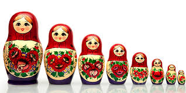

&nbsp;

<strong>Deskripsi</strong>

Mus akan melakukan perjalanan untuk mencari pujaan hatinya. Ia sudah bertekad untuk mencari wanita idamannya itu walau sampai kemanapun. Perjalanannya membawanya sampai ke negara russia. Disana, sembari mencari sang pujaan hati Mus melihat satu benda unik yaitu boneka khas russia, atau yang lebih dikenal dengan nama <em>Matryoshka doll</em>.

Yang membuat Mus tertarik adalah satu <em>M</em><em>atry</em><em>os</em><em>hka do</em><em>ll</em> dimasukkan ke dalam <em>Mathryoshka doll</em> lain yang berukuran lebih besar. Melihat itu, Mus jadi berniat untuk memberikan wanita yang sedang dicarinya ini beberapa <em>Matryoshka doll</em> ketika mereka bertemu nanti.

Akhirnya Mus memutuskan untuk membeli N buah boneka. Tetapi, karena barang bawaan Mus sangat banyak, Mus akan memasukkan boneka-boneka tersebut kedalam boneka lain agar jumlah boneka yang berada di bagian paling luar seminimal mungkin. Bantulah Mus mencari jumlah tersebut

<strong>Format Masukan</strong>

Baris pertama berisi sebuah bilangan T yang menyatakan banyaknya kasus uji.

Untuk setiap kasus uji terdiri dari beberapa baris.

Baris pertama berisi sebuah bilangan N. Banyaknya boneka yang dibeli Mus.

N baris berikutnya berisi 3 buah bilangan Pi,Li,Hi&nbsp;yang masing-masing merupakan panjang, lebar, dan tinggi dari boneka ke-i. Boneka i dapat dimasukkan ke dalam boneka j jika dan hanya jika Pi&nbsp;&lt; Pj, Li&nbsp;&lt; Lj&nbsp;dan Hi&nbsp;&lt; Hj.

<strong>Format Keluaran</strong>

Untuk setiap kasus uji, keluarkan sebuah bilangan yang merupakan jumlah boneka minimal yang berada di bagian paling luar.

<strong>Contoh Masukan</strong>

<pre>
3
3
1 1 1
2 2 2
3 3 3
2
1 5 1
2 3 2
4
2 5 7
3 7 9
3 9 8
6 10 12</pre>

<strong>Contoh Keluaran</strong>

<pre>
1
2
2
</pre>

<strong>Batasan</strong>

1 <u>&lt;</u>&nbsp;T <u>&lt;</u>&nbsp;100

1 <u>&lt;</u>&nbsp;N <u>&lt;</u>&nbsp;500

1 <u>&lt;</u>&nbsp;Pi,Li,Hi&nbsp;<u>&lt;</u>&nbsp;10000

